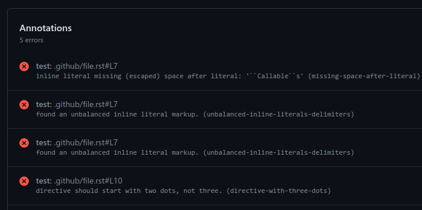

# sphinx-lint-problem-matcher

[](https://github.com/rffontenelle/sphinx-lint-problem-matcher/actions/workflows/test.yml)

This action adds a GitHub Action problem matcher that annotates messages
printed by [sphinx-lint][sphinx-lint], making it easier to spot Sphinx
syntax errors.

How it shows up in the summary page of a GitHub Action run:



## Usage

Set to use this workflow before running `sphinx-lint`. For instance:

```yaml
    - uses: rffontenelle/sphinx-lint-problem-matcher@v1
    - run: sphinx-lint docs/*.rst
```

## Acknowledgement

Inspired by Sphinx's [github-problem-matcher][sphinx-gpm], created by Ammar Askar.

[sphinx-lint]: https://github.com/sphinx-contrib/sphinx-lint
[sphinx-gpm]: https://github.com/sphinx-doc/github-problem-matcher
